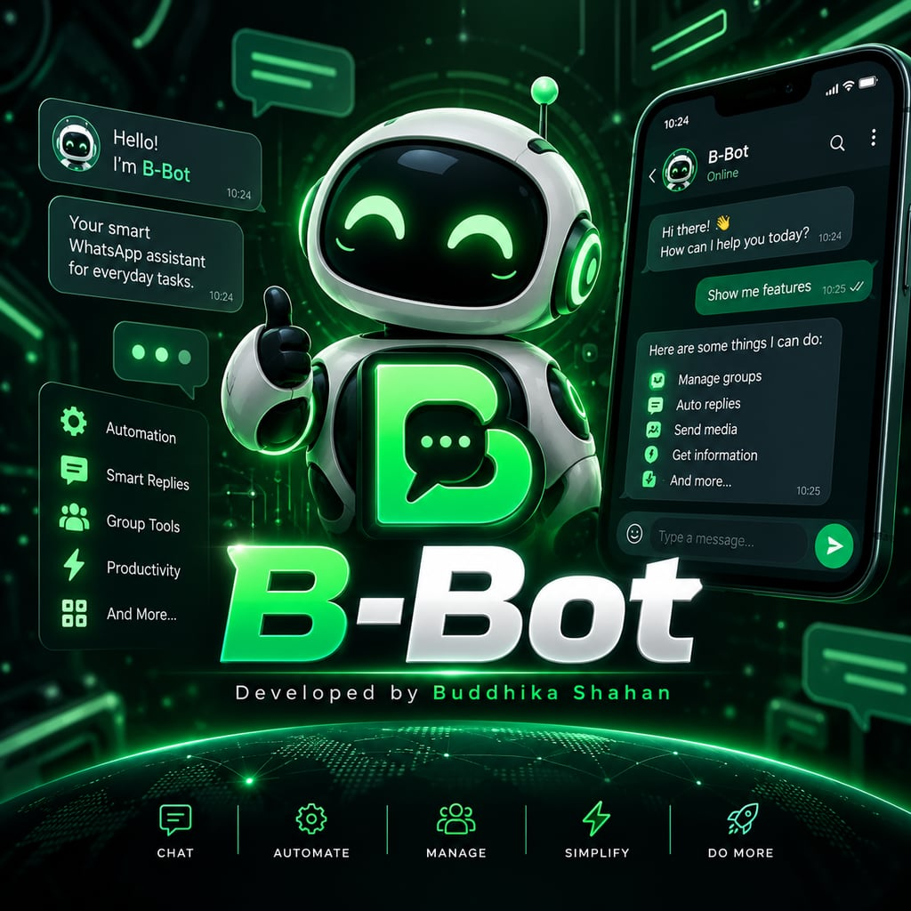

# B-Bot

<p align="center"></p>

[](https://github.com/buddhikashahan/b-bot/actions/workflows/ci.yml)

A self-hosted WhatsApp bot with a web dashboard, built on [Baileys](https://github.com/WhiskeySockets/Baileys).

- **Pair from the browser** with a live QR code or an 8-character pairing code
- **Anti-delete and anti-edit**: recovers messages deleted for everyone, and shows edits before/after
- **Anti view-once**: saves view-once photos, videos and voice notes as normal media (see the note below on how)
- **Status automation**: auto-view and/or forward contacts' statuses
- **Call rejection**: declines calls and tells the caller to message instead, in text or with a spoken voice note
- **AI assistant**: Google Gemini answers ordinary messages, with your own instructions, photo understanding and per-chat memory
- **Reply-by-number menus**: the bot's own menu, search results, download format choices, and menus you design in the dashboard; optionally as tappable buttons
- **Auto-replies**: keyword rules and an away message
- **Group protection**: anti-link (whitelist, delete / warn / kick), warnings, welcome and farewell messages
- **Scheduler and broadcasts**: one-off, recurring (cron) and multi-recipient messages that survive restarts
- **Access control**: public or private mode, groups-only / private-only commands, blocked people, ignored groups
- **Media downloads**: songs and videos from YouTube, Facebook, TikTok, Instagram, X, Pinterest, Threads, Snapchat, Reddit, SoundCloud, Vimeo, Dailymotion, Twitch, Bilibili and Likee, with thumbnail previews and a choice of quality (audio, MP3, small file, voice note, 360p to 1080p, or as a document)
- **Media tools**: stickers from photos and videos, voice notes, MP3 extraction, GIFs, trimming, sound effects, photo effects and meme captions
- **Voice conversations**: the assistant listens to voice notes and answers with a voice note in the same language
- **Text to speech and translation**: natural AI voices and AI translation with a Gemini key, basic free services without one
- **Look-ups**: films and series, news, crypto prices, world clock, Wikipedia, dictionary, weather, translation, currency, link shortener, GitHub
- **Commands and plugins**: 128 built-in chat commands with WhatsApp-formatted replies, plus drop-in plugin files
- **Your branding**: bot name, cover image on the menu, and a developer card with contact, website and profile link
- **Dashboard**: works on phones, tablets and desktops; getting-started guide, quick switches, live activity feed, instant-save settings, built-in help, live logs
- **Any database**: SQLite out of the box; PostgreSQL, MySQL or MongoDB by changing one URL

> **Use at your own risk.** B-Bot uses the unofficial WhatsApp Web protocol. Automating a personal
> account is against WhatsApp's Terms of Service, and accounts that send bulk or unwanted messages get
> banned. Recovering deleted or view-once content may also be restricted by privacy law where you live.
> Use a number you can afford to lose and only message people who expect it.

## Quick start

### Docker (recommended)

```bash
docker compose up -d
```

Open <http://localhost:3000>, choose a dashboard password, then link your phone on the **Connection** page.
All state lives in the `bbot-data` volume. The container runs as the non-root `node` user.

If the port is reachable by other people, set `DASHBOARD_PASSWORD` in `.env` before the first start;
otherwise whoever opens the dashboard first picks the password.

**Health check.** `GET /api/health` needs no login and answers `200 {"ok":true,...}` while the server is
up and can read its database, `503` otherwise. Whether WhatsApp is linked is deliberately not part of it:
a bot waiting to be paired is still a healthy container. The image declares this as its Docker
`HEALTHCHECK` (every 15 s, 5 s timeout, 3 retries, 90 s start period), so `docker ps` shows `healthy`.

### Coolify

Create the application from this repository. Both build packs work:

- **Dockerfile** (recommended): the image this repository defines, with its own health check, a non-root
  user and everything the media commands need.
- **Railpack** (Coolify's default): builds from `package.json`; `railpack.json` adds the fonts the photo
  commands need and the `curl` that Coolify's health check runs inside the container. The health check
  has to be entered in Coolify (below).

| Setting | Value |
| --- | --- |
| Ports Exposes | `3000` |
| Persistent storage | a volume mounted at `/app/data` (the WhatsApp link, database and settings live there) |
| Environment | `TRUST_PROXY=true`, `DASHBOARD_PASSWORD=<yours>`, optionally `TZ` and `DATABASE_URL` |
| Container name (General) | any fixed name, e.g. `b-bot`: see the note below |

**Health check.** With the Dockerfile build pack there is nothing to configure: Coolify detects the
`HEALTHCHECK` in the Dockerfile and uses it in place of the one in its dashboard. With Railpack, enable
it under **Configuration > Healthcheck**: method `GET`, scheme `http`, host `localhost`, port `3000`, path
`/api/health`, interval `15`, timeout `5`, retries `3`, start period `90`.

**Database.** Leave `DATABASE_URL` unset to keep everything in the SQLite file on the volume, or point it
at PostgreSQL, MySQL or MongoDB. MongoDB has to run as a replica set (Atlas does; a single MongoDB
container does not unless it is started as one), because the database layer uses transactions. The
volume is still needed with an external database: the WhatsApp link is kept on disk unless you also set
`AUTH_STORE=database`.

Set a fixed container name. With a passing health check and the default name, Coolify deploys by
starting the new container next to the old one and only then stopping the old one. For a moment two bots
would share one WhatsApp link and one data folder: WhatsApp drops one of the two connections and both may
answer the same message. A fixed container name makes Coolify stop the old container first, at the price
of a few seconds without the dashboard.

### Node.js

Requires Node.js 22 or newer.

```bash
npm install
npm run build
npm start          # http://localhost:3000
```

For development, `npm run dev` runs the API on port 3000 with reload and the dashboard on
<http://localhost:5173>.

## Linking your phone

1. Open **Connection** and choose **QR code** or **Pairing code**.
2. On your phone: WhatsApp > Settings > Linked devices > Link a device.
3. Scan the QR code, or tap "Link with phone number instead" and type the code.

The session is saved, so B-Bot reconnects by itself after restarts and network drops (exponential
backoff, capped at 5 minutes). **Stop** closes the connection but keeps the link; **Log out** unlinks
the device and erases the stored credentials.

### Headless mode

No browser available? Set `HEADLESS=true`. The QR code is printed in the terminal (`docker logs -f b-bot`).
Add `PAIRING_PHONE=15551234567` to get a pairing code instead. The dashboard is not served in this
mode; only `/api/health` is.

## Configuration

Everything is optional. Copy `.env.example` to `.env` to override defaults.

| Variable | Default | Purpose |
| --- | --- | --- |
| `PORT` / `HOST` | `3000` / `0.0.0.0` | Where the dashboard listens |
| `DASHBOARD_PASSWORD` | set in browser | Fixes the dashboard password (it can then no longer be changed in the UI) |
| `DATABASE_URL` | SQLite in `data/` | `postgresql://`, `mysql://`, `mongodb://` or `file:` URL |
| `AUTH_STORE` | `file` | `file`: credentials on disk, mirrored to the database. `database`: credentials only in the database |
| `DATA_DIR` | `./data` | Sessions, SQLite file, media cache, uploads, plugins |
| `HEADLESS` / `PAIRING_PHONE` | off | Pair in the terminal instead of the dashboard |
| `TRUST_PROXY` | `false` | Set to `true` behind an HTTPS reverse proxy |
| `APP_SECRET` | generated | Signs login cookies |
| `LOG_LEVEL` | `info` | `debug`, `info`, `warn`, `error` |
| `WA_VERSION` | bundled | Pin a WhatsApp Web version (`2,3000,1023223821`) if connections are rejected |
| `YTDLP_PATH` / `FFMPEG_PATH` | automatic | Use your own yt-dlp or ffmpeg instead of the ones B-Bot finds or installs |

Feature settings (anti-delete, prefix, alert chat, and so on) are edited in the dashboard and stored in the database.

### Changing database

Set `DATABASE_URL` and restart, or, when it is not set in the environment, use
**Settings > Database** in the dashboard. On every start the launcher detects the provider from the
URL, renders the Prisma schema for it, regenerates the client if needed and syncs the tables. If a
database chosen in the dashboard cannot be reached, B-Bot falls back to SQLite and shows the error
instead of failing to boot.

- Data is **not** migrated between databases; the new one starts empty. The dashboard password is carried over.
- MongoDB must run as a replica set (Atlas clusters do).
- Bundled PostgreSQL: set `POSTGRES_PASSWORD` (default `bbot`) and
  `DATABASE_URL=postgresql://bbot:<password>@postgres:5432/bbot` in `.env`, then run
  `docker compose --profile postgres up -d` (Docker Compose 2.20+).

Prisma is pinned to 6.x on purpose: it is the last line where all four providers work with the same
schema and no driver adapters.

## Features

**Where alerts go.** Recovered messages, revealed media and forwarded statuses are sent to the *alert
chat*: your own "Message yourself" chat by default, or any group or chat you pick under **Protection**.

**Anti-delete.** Incoming messages are cached for 1 to 48 hours (24 by default), media included up to a
size limit. When a message is deleted for everyone, the original is forwarded with the sender, chat and
timestamps. Expired entries and their files are purged automatically.

**Anti-edit.** With anti-delete on, an edited message is reported with its text before and after.

**Anti view-once.** WhatsApp no longer delivers view-once media to linked devices; they only receive a
stub saying "open this on your phone". B-Bot therefore cannot open a view-once on its own. What it does:

1. It notices the stub, asks your phone to share the content (WhatsApp usually declines), and after a few
   seconds sends a note to your alert chat saying who sent a view-once and where.
2. **You reply to that view-once message from your phone** with any text. WhatsApp embeds the original,
   media keys included, in the reply, and B-Bot uses that to download the media and save a normal copy to
   your alert chat. A reply from anyone else in the chat works the same way.
3. `.vv` (reply to the view-once with it) does the same on demand; `.vv here` posts the copy into the chat.

**Calls.** Incoming calls can be declined automatically, with an optional message to the caller: a text,
or (**Protection > Calls > Answer the caller with a voice note**) a short spoken message in the assistant's
voice. A call itself cannot be picked up: WhatsApp gives a linked device the ring but not the call's audio,
and no library for linked devices can join a call, so a live spoken conversation over the call (for
example through Gemini's Live API) is not possible this way. The nearest thing is built in: with the AI
assistant on, the caller answers the voice note with one of their own and the conversation carries on by
voice note.

**Auto-replies.** Keyword rules (contains / is exactly / starts with, per chat type) answer common
messages; `{name}` inserts the sender's name. The away message answers each private chat once per
cooldown, and is skipped whenever the AI assistant answers the message (it steps in only if the AI is
off or could not answer). Commands take priority over rules, and replies are throttled per chat so two bots cannot loop.

**Access control.** *Public* mode lets anyone use commands; *private* mode restricts them to owners.
Commands can also be limited to groups only or private chats only. Blocked people get no response at all
(their deleted messages are still recovered). Ignored groups are invisible to the bot: no commands, no
moderation, nothing recorded. The linked account can always run commands, including inside an ignored
group, which is how `.ignore off` works.

**AI assistant.** Add a Gemini API key on the **AI assistant** page (free keys come from
[Google AI Studio](https://aistudio.google.com/apikey)); the key is checked with Google before it is
saved (by listing the models it can use, which takes a moment and costs nothing), stored in the
database, and never sent back to the browser. With the assistant switched on, messages that are not
commands are answered by the model (`gemini-3.5-flash` by default).

- **Your instructions.** Write who the assistant is and what it knows, or start from a preset. A short
  fixed rule set is always added so answers suit WhatsApp (brief, WhatsApp formatting, the sender's language).
- **Where it answers.** Private chats, groups, or both. In groups it answers only when mentioned or
  replied to unless you choose "every message".
- **Answer speed.** Gemini 3 models reason before answering. B-Bot asks for the lowest level ("Fast")
  so replies arrive in seconds; "Balanced" and "Thorough" trade waiting time for more careful answers.
  For the quickest and cheapest replies choose one of the `-lite` models.
- **Backup model.** Google's newest models are often at capacity: they answer `503 high demand` or do
  not answer at all. The main model therefore gets a short head start (7 seconds on "Fast"); if it is
  still silent, the backup model (`gemini-3.1-flash-lite` by default) is asked as well and whichever
  answers first is used. A model that failed is tried last for the next five minutes, so later replies
  are immediate. The AI assistant page shows which model answered and says when the backup is standing in.
- **Memory.** The latest messages of each chat (12 by default, 0 to 40) are sent along as context.
  Anything older than a day is not used and is erased after a week. `.resetai` forgets a chat.
- **Photos.** Pictures are downsized and sent to the model so it can describe them or answer about them.
- **Order of precedence.** Commands, then a menu reply, then dashboard menus, then keyword auto-replies,
  then the AI, and only if none of those answered, the away message. Anything typed like a command
  (a typo, a switched-off command, someone who may not use commands) is never treated as conversation:
  no AI answer and no away message, just a "did you mean" hint when the name is close to a real command. Blocked people and ignored groups are never answered. At most 8 automatic answers per chat
  per minute, so two bots cannot loop.
- **Commands.** `.ai <question>` asks directly (also about a replied-to message or photo) and works even
  when automatic answers are off; `.summarize`, `.ocr` and `.describe` are one-off tasks.
- **Speech and translation.** `.tts <text>` (or a reply to a message) answers with a voice note in one of
  Gemini's voices (`.tts puck Hello`), in whatever language the text is written. `.translate sinhala Good morning`
  translates with the model. Without a key, or while Google is busy, both fall back to free services
  (Google Translate's voice, MyMemory) with shorter length limits.
- **Voice notes.** When someone sends a voice note the assistant listens to it and replies with a voice
  note in the language they spoke (typically 10 to 20 seconds later), remembering what was said like any
  other message. The voice is chosen on the **Assistant** page, where listening and spoken replies can
  each be switched off; music files and recordings over five minutes are left alone.
- What people write, and the photos and voice notes they send, go to Google for processing. Usage beyond Google's free
  tier is billed by Google to the key's account.

**Reply-by-number menus.** Whenever the bot sends a numbered list, it stores what each number means in
the database (`MenuPrompt` table) against that message. Replying to the message with a number carries out
the option; in a private chat a bare number within ten minutes works too. Menus keep working after a restart
and stay answerable for a day.

- `.menu` lists categories; a number opens one; a number there runs the command, or explains it when it
  needs input. `.menu all` prints everything on one page.
- `.yts`, `.imdb` and `.news` results, and the format choices of `.song` and `.video`, are numbered the same way.
- **Tappable buttons (experimental).** The **Menus** page has a switch that sends menus as WhatsApp
  interactive messages instead of plain text, never with more than three buttons. Menus of yours with up
  to three options become buttons. The format choice of `.song` and `.video` (on top of the video's
  thumbnail) shows its two usual picks as buttons and keeps the rest behind "More options". The
  `.developer` card gets contact, portfolio and GitHub buttons. Long menus (`.menu`, search results) become
  a pick-list, and `.menu` adds an "All commands" button beside it. Cover images and thumbnails are shown
  as the header of the message.
  WhatsApp supports these officially only for Business API accounts, so from an ordinary linked account
  they are best-effort: they render on current phones but not everywhere (WhatsApp Web in particular), and
  WhatsApp can stop showing them at any time, which is why this is off by default. Replying with a number
  keeps working, and if such a message cannot be sent the plain numbered one goes out in its place.
- On the **Menus** page you can build your own: a trigger ("hi"), a title, a greeting, and options that
  send a reply, open another menu, or run a command. A live preview shows how it will look.

**Downloads.** `.song` and `.video` take a name or a YouTube link and answer with the video's details on
its thumbnail and a numbered choice of formats, the usual ones first: audio that plays in the chat, audio
as a document, MP3 (192 kbps), a small 64 kbps file, a voice note, video at 360p / 480p / 720p / 1080p, or
video as a document. `.play` skips
the question and sends the audio straight away; `.yta mp3 <link>` and `.ytv 480 <link>` name the format
directly; `.thumb` fetches a thumbnail; `.yts` searches YouTube. `.fb`, `.tiktok`, `.insta`, `.x`, `.pin`,
`.threads`, `.snap`, `.reddit`, `.soundcloud`, `.vimeo`, `.dailymotion`, `.twitch`, `.bilibili` and `.likee`
take a link from that service; add `audio` for the sound only or `doc` to get a file. The work is done by
[yt-dlp](https://github.com/yt-dlp/yt-dlp), which B-Bot downloads into `data/bin` the first time it is
needed (the official release, verified against its published checksum) and by ffmpeg, which comes with
`npm install` through the optional `ffmpeg-static` package. Files are fetched to a temporary folder, sent,
and deleted.

- Limits (largest file, longest video, owners only, on/off) are on the **Commands** page. When a video
  is too big at the chosen quality the bot picks a lower one that fits. When a site refuses a stream
  ("403 Forbidden") the bot retries and then falls back to a plainer version of the same video.
- Sites change often. If downloads start failing, press **Update downloader** on the Commands page or send
  `.updatedl`.
- Some posts (private accounts, many Instagram reels, age-restricted videos) only download when logged in.
  Export your browser cookies for that site in Netscape format and save them as `data/cookies.txt`.
- Site commands only accept links to their own service, and no command will fetch from local or private
  network addresses. `.dl <link>` (any site yt-dlp supports) is owner-only for that reason.
- Only download what you have the right to save. Downloading may be against a site's terms of service.

**Media tools.** Reply to a photo, video, audio or sticker (or send it with the command as its caption).
`.sticker` makes a sticker from a photo, or an animated one from a GIF or short video; `.circle` a round
one; `.toimg` turns a sticker back into a picture. `.tomp3` pulls the sound out of a video, `.tovn` makes
a voice note, `.togif` a looping GIF and `.trim 0:30 1:15` cuts a piece out. Sound effects: `.bass`,
`.nightcore`, `.slow`, `.fast`, `.deep`, `.chipmunk`, `.reverse`. Photo effects: `.blur`, `.grey`, `.invert`,
`.vflip`, `.mirror`, `.rotate`, `.enhance` and `.meme top text | bottom text`. Everything runs on your
server with ffmpeg and sharp; files up to 40 MB are accepted.

**Branding.** `.menu`, `.botinfo` and `.developer` are sent with the cover image. Put your own
`cover.jpg` (or `.png` / `.webp`) in the data folder to replace the bundled one, or switch covers off on
the **Menus** page. The bot's name and the developer card (name, website, profile link, and a WhatsApp number
that is also shared as a contact card) are edited under **Settings > Branding and developer**; clear a
field to leave it off the card.

**Look-ups.** `.imdb`, `.news`, `.crypto`, `.time`, `.wiki`, `.define`, `.weather`, `.translate`, `.convert`,
`.shorten` and `.github` call free public services (Cinemeta, Google News, CoinGecko, Open-Meteo,
Wikipedia, dictionaryapi.dev with Wiktionary as its stand-in, MyMemory, open.er-api.com, is.gd / TinyURL, GitHub). The text people
type after those commands is sent to the respective service.

**Activity.** Everything the bot does (recoveries, reveals, removed links, declined calls, commands,
auto-replies, scheduled sends) is listed on the Overview and Activity pages for 14 days.

**Groups.** Each group has its own anti-link rule (WhatsApp invites only, or every link; delete, warn
with a limit, or kick; a domain whitelist) and welcome / farewell texts with `{user}`, `{group}`,
`{desc}` and `{count}`. The bot must be a group admin to delete messages or remove members. Admins and
owners are never filtered.

**Scheduler.** Jobs are rows in the database. A due message that cannot be sent because WhatsApp is
offline waits and goes out when the connection returns. Failed recipients are retried with backoff, and
delivery progress is recorded per recipient, so a retry (or a restart mid-broadcast) only reaches the
people who have not received it yet. Broadcasts pause a random 2 to 5 seconds between recipients.

## Commands

The default prefix is `.` (change it on the **Commands** page). Send `.menu` for the full list.

| Category | Commands |
| --- | --- |
| General | `menu`, `ping`, `uptime`, `botinfo`, `owner`, `developer`, `report`, `jid` |
| AI assistant | `ai`, `summarize`, `ocr`, `describe`, `resetai` |
| Downloads | `yts`, `song`, `video`, `play`, `yta`, `ytv`, `thumb`, `ytpick`, `fb`, `tiktok`, `insta`, `x`, `pin`, `threads`, `snap`, `reddit`, `soundcloud`, `vimeo`, `dailymotion`, `twitch`, `bilibili`, `likee` |
| Search & info | `imdb`, `news`, `crypto`, `time`, `wiki`, `define`, `weather`, `convert`, `shorten`, `github` |
| Media | `sticker`, `circle`, `toimg`, `tomp3`, `tovn`, `togif`, `trim`, `bass`, `nightcore`, `slow`, `fast`, `deep`, `chipmunk`, `reverse`, `blur`, `grey`, `invert`, `vflip`, `mirror`, `rotate`, `enhance`, `meme` |
| Tools | `tts`, `translate`, `remind <time> <text>`, `calc`, `qr`, `poll`, `pp`, `genpass` |
| Group admin | `kick`, `add`, `promote`, `demote`, `warn`, `warnings`, `resetwarn`, `del`, `tagall`, `hidetag`, `admins`, `link`, `revoke`, `setname`, `setdesc`, `mute`, `unmute`, `lock`, `unlock`, `antilink`, `welcome`, `goodbye`, `groupinfo` |
| Fun | `8ball`, `flip`, `roll`, `choose`, `rate`, `joke`, `fact`, `truth`, `dare`, `fancy` |
| Owner | `mode`, `scope`, `block`, `unblock`, `blocklist`, `ignore`, `antidelete`, `viewonce`, `autostatus`, `anticall`, `autoread`, `autoreply`, `assistant`, `away`, `setprefix`, `vv`, `save`, `dl`, `updatedl`, `leave` |

`.menu` opens the numbered menu, `.menu all` shows everything in boxed sections, `.menu downloads` opens
one category and `.menu song` explains one command. Replies use WhatsApp formatting throughout (bold labels, `inline code` for commands, quoted
blocks for recovered text); the helpers live in [server/src/whatsapp/format.ts](server/src/whatsapp/format.ts).

The linked account is always an owner; add more numbers under **Access > Owners**.

### Writing a plugin

Put an ES module in `data/plugins/` and press **Reload plugins** on the Commands page.

```js
// data/plugins/hello.js
export default {
  name: 'hello',
  aliases: ['hi'],
  category: 'fun', // admin | general | utility | media | fun
  description: 'Say hello back.',
  cooldown: 5, // seconds
  // ownerOnly, groupOnly, adminOnly, botAdmin are also available
  async execute(ctx) {
    await ctx.reply(`Hello ${ctx.senderName || 'there'}!`);
  }
};
```

`ctx` gives you `reply`, `send`, `react`, `args`, `text`, `mentions`, `quoted`, `isOwner`, `isAdmin`,
`group`, the raw `msg` and the Baileys `sock`; see [server/src/commands/types.ts](server/src/commands/types.ts).
A file may export an array of commands. Plugins run with the bot's full privileges, so only install code you trust.

## Project layout

```
server/
  scripts/start.mjs         launcher: prepares the database, runs and restarts the server
  scripts/prepare-db.mjs    provider detection, schema rendering, prisma generate + db push
  prisma/schema.template.prisma
  assets/cover.jpg          default cover image
  src/
    whatsapp/               session lifecycle, auth stores, event pipeline
    features/               anti-delete, view-once, status, calls, AI assistant, menus, auto-replies, access,
                            activity, group guard, downloader, media tools, speech, branding
    commands/               registry, plugin loader, built-in commands
    scheduler/              persistent job engine
    api/                    Fastify REST routes + WebSocket
web/                        React + Vite + Tailwind dashboard (built into server/public)
```

The code is keyed by session id throughout (`SessionManager`, every table, `/api/sessions/:id/...`),
with a single `default` session created today, so running several accounts is an extension rather than a rewrite.

## Testing

```bash
npm test              # offline suites: pipeline, features, AI assistant, menus, media conversion
npm test -- --live    # also the suites that call public services and download media
npm test -- core      # only suites whose file name contains "core"
```

Every suite runs against its own throwaway data folder and SQLite database, with a fake WhatsApp
socket and a local stand-in for the Gemini API, so tests never touch a real installation or account.
CI runs the offline suites, the type check, the production build and a Docker image smoke test on every
push.

## Security notes

- **Nothing secret lives in the repository.** Credentials, databases, cached media, uploads and the
  downloader binary are all under `data/`, which is git-ignored along with `.env`. Never commit either.
- The AI API key is encrypted (AES-256-GCM) with the instance secret before it is written to the
  database, and is never sent back to the browser. The instance secret is `APP_SECRET`, or
  `data/secret.key` when that is not set; if it is lost, re-enter the key in the dashboard.
- API requests are rate-limited per client, the password endpoints much more tightly.

- The dashboard is protected by one password (scrypt-hashed, or supplied by `DASHBOARD_PASSWORD`), a
  signed HTTP-only `SameSite=Strict` cookie, and rate-limited login. Put it behind HTTPS (and set
  `TRUST_PROXY=true`) if you expose it beyond your own network.
- `data/` contains your WhatsApp credentials and recovered messages. Treat it, and its backups, as secret.
- With `AUTH_STORE=file` the credentials are also mirrored into the database, so database access is equivalent to account access.

## Updating

Stop B-Bot, pull or copy the new code, then:

```bash
npm install
npm run build
npm start
```

New tables and columns are added to your database on start; existing settings, schedules and the
WhatsApp link are kept. On Windows, stop the bot before building: a running bot holds the database
engine file open and the build cannot replace it.

## Backup

Stop the container and copy the `bbot-data` volume (or the `data/` folder). With an external database,
back that up as well.
